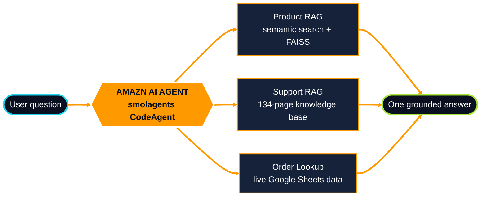
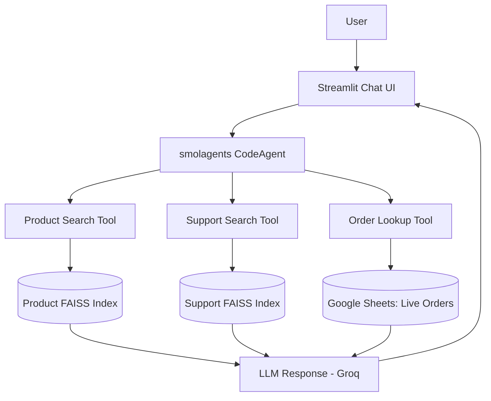
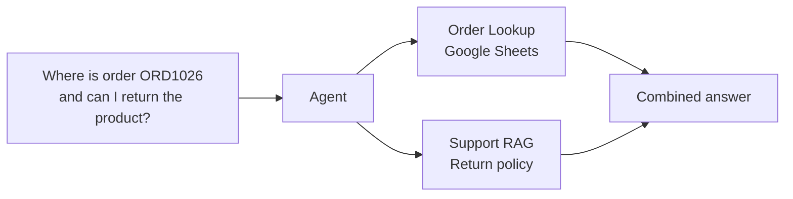
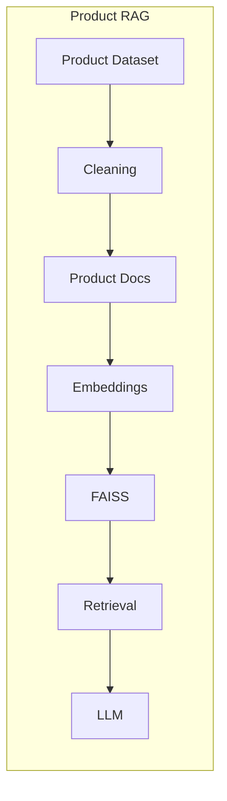
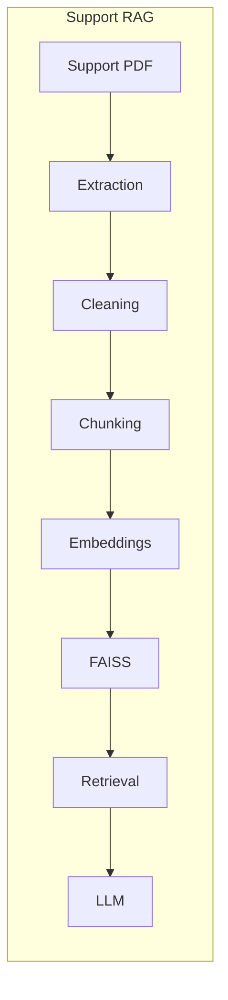

<h1 align="center">Amazn AI</h1>



<p align="center">
  <b>A multi-tool agentic AI assistant that searches products, answers support questions, and tracks live orders, all from one chat.</b>
</p>

<p align="center">
  
  
  
  
  
  
  
</p>

<p align="center">
  <a href="YOUR_STREAMLIT_APP_URL"><b>Live Demo</b></a> &nbsp;•&nbsp;
  <a href="#architecture">Architecture</a> &nbsp;•&nbsp;
  <a href="#what-this-project-demonstrates">Skills</a> &nbsp;•&nbsp;
  <a href="#run-it-locally">Run Locally</a>
</p>

---

## TL;DR (for recruiters and hiring managers)

| | |
|---|---|
| **What it is** | An end-to-end, deployed AI application with an LLM agent that routes each question to the right tool |
| **Tools the agent orchestrates** | Product RAG, Support RAG (134-page knowledge base), live order lookup via Google Sheets |
| **Standout capability** | Multi-tool reasoning: one question can trigger several tools and return one combined answer |
| **Stack** | Python, smolagents, FAISS, Sentence Transformers, Groq (via LiteLLM), Google Sheets API, Streamlit |
| **Shipped?** | Yes. Deployed on Streamlit Cloud with secrets managed outside the repo |

> **Try asking:** *"Where is order ORD1026 and can I return the product?"*
> The agent looks up the order in Google Sheets, retrieves the return policy from the support knowledge base, and answers in a single response.

---

## Why This Project Matters

Most RAG demos are a single retrieval pipeline behind a chat box. Real customer-support systems are not: they need product knowledge, policy knowledge, **and** live operational data.

Amazn AI shows how to build that properly:

- **Agentic routing** instead of one-size-fits-all retrieval
- **Separate knowledge bases** for products and support, each with its own index
- **Live data** (orders) fetched at query time rather than baked into static embeddings
- **Production concerns** handled: secrets, read-only credentials, and deployment

---

## Key Features

### Product RAG: semantic product discovery
Natural-language search over an Amazon product dataset.

- Data cleaning and product document creation
- Sentence Transformers embeddings + FAISS vector search
- LLM-generated answers grounded in retrieved products

```text
Find the best products under ₹4,000
```

### Support RAG: policy and help answers
A dedicated pipeline over a **134-page** Amazon-style support knowledge base.

- PDF extraction with PyMuPDF (page-aware)
- Text cleaning and fixed-size chunking with overlap
- Sentence Transformers embeddings + FAISS similarity search
- Answers generated from retrieved context

```text
I received a damaged product. Can I return it?
How long does a refund take?
```

> The support knowledge base is a compiled Amazon-style reference document. It is **not** an official or live Amazon policy source.

### Live Order Lookup: Google Sheets integration
A read-only Google Sheets tool gives the agent real-time order data instead of static RAG content.

Returns: Order ID, customer name, product ID/name, order date, status, expected delivery, payment status, delivery address, tracking ID.

```text
Where is my order ORD1026?
```

---

## Architecture

### Agent and tool routing

A `smolagents` **CodeAgent** reads the user's request, decides which tool(s) to call, and composes the final answer.



### Multi-tool reasoning



### RAG pipelines





---

## Technology Stack

| Area | Tools |
|---|---|
| **Language and data** | Python, Pandas, NumPy |
| **Retrieval and RAG** | Sentence Transformers, FAISS, PyMuPDF |
| **Agent and LLM** | smolagents, LiteLLM, Groq |
| **Integrations** | gspread, Google Auth, Google Sheets API |
| **App and deployment** | Streamlit, Streamlit Cloud |
| **Dev workflow** | Jupyter Notebook, Git, GitHub |

---

## What This Project Demonstrates

| Skill area | Evidence in this repo |
|---|---|
| **Retrieval-Augmented Generation** | Two independent RAG pipelines with separate indexes |
| **Vector search** | Embedding generation and FAISS indexing for products and support docs |
| **Agentic AI and tool calling** | CodeAgent that selects and chains tools |
| **Multi-tool orchestration** | Combined order + policy answers in one response |
| **External API integration** | Read-only Google Sheets order lookup |
| **Data and document processing** | Dataset cleaning, PDF extraction, chunking with overlap |
| **Security hygiene** | Env-based secrets, read-only credentials, nothing sensitive committed |
| **Shipping to production** | Streamlit UI, dependency config, cloud deployment |

---

## Project Structure

```text
Amazn-AI/
├── Assets/
│   └── Amazn.png
├── data/
│   ├── raw/
│   │   ├── amazon.csv
│   │   └── Amazon-Support.pdf
│   └── cleaned/
│       └── amazon_cleaned.csv
├── notebooks/
│   ├── product-rag/EDA.ipynb
│   └── support-rag/Support-RAG.ipynb
├── src/
│   ├── agent.py        # Agent + tool definitions
│   ├── llm.py          # LLM configuration
│   ├── orders.py       # Google Sheets order lookup
│   ├── paths.py
│   └── rag.py          # Product + support retrieval
├── vector_store/
│   ├── product_index.faiss
│   ├── product_documents.json
│   ├── product_metadata.json
│   ├── support_index.faiss
│   └── support_chunks.json
├── app.py              # Streamlit app
├── requirements.txt
└── README.md
```

---

## Run It Locally

**1. Clone**

```bash
git clone https://github.com/ather-ops/Amazn-AI.git
cd Amazn-AI
```

**2. Create and activate a virtual environment**

```bash
python -m venv .venv
source .venv/Scripts/activate   # Windows Git Bash
# source .venv/bin/activate     # macOS / Linux
```

**3. Install dependencies**

```bash
pip install -r requirements.txt
```

**4. Configure environment variables**

```env
GROQ_API_KEY=your_groq_api_key
GOOGLE_CREDENTIALS_PATH=path/to/service-account.json
GOOGLE_SHEET_ID=your_google_sheet_id
```

> Google Sheets access is **read-only**. Never commit credentials to the repository.

**5. Launch**

```bash
streamlit run app.py
```

---

## Development Journey

| Phase | What I built |
|---|---|
| **1. Product RAG** | Explored and cleaned the dataset, built product documents, embeddings, FAISS index, and LLM-connected retrieval |
| **2. Support RAG** | Extracted page-aware PDF text, cleaned and chunked it, built the support index and retrieval flow |
| **3. Agentic architecture** | Introduced smolagents, wrapped each pipeline as a tool, added Google Sheets order lookup, enabled agent routing |
| **4. Deployment** | Built the Streamlit chat UI, configured production dependencies, secured Google Sheets access, deployed to Streamlit Cloud |

**Status:** Product RAG: Complete &nbsp;|&nbsp; Support RAG: Complete &nbsp;|&nbsp; Order Tool: Complete &nbsp;|&nbsp; Agent: Complete &nbsp;|&nbsp; Streamlit App: Complete &nbsp;|&nbsp; Deployed

---

## Roadmap

- Retrieval reranking and quality evaluation
- Conversation memory
- Structured tool outputs
- Agent observability and tracing
- Automated evaluation datasets
- Production-grade monitoring

---

## License

Released under the [MIT License](LICENSE).
